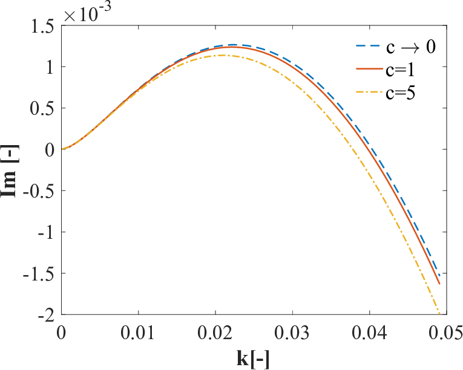

# Problem 2

# Investigating the Dynamics of a Forced Damped Pendulum

[Simulation](Problem_2.html)

## Task Breakdown

### 1. Theoretical Foundation

#### Governing Equation
The motion of a pendulum of length $L$ with mass $m$, subject to gravitational acceleration $g$, damping coefficient $b$, and an external force $F(t) = F_0 \cos(\omega t)$, is governed by:

$$m L \frac{d^2\theta}{dt^2} + b \frac{d\theta}{dt} + m g \sin\theta = F_0 \cos(\omega t)$$

Dividing through by $m L$:

$$\frac{d^2\theta}{dt^2} + \frac{b}{m} \frac{d\theta}{dt} + \frac{g}{L} \sin\theta = \frac{F_0}{m L} \cos(\omega t)$$

Define:

- $\gamma = \frac{b}{m}$ (damping per unit mass),
- $\omega_0 = \sqrt{\frac{g}{L}}$ (natural frequency),
- $f = \frac{F_0}{m L}$ (forcing amplitude per unit mass).

The equation becomes:

$$\frac{d^2\theta}{dt^2} + \gamma \frac{d\theta}{dt} + \omega_0^2 \sin\theta = f \cos(\omega t)$$

This is a nonlinear second-order differential equation due to $\sin\theta$.

#### Small-Angle Approximation

For small $\theta$, $\sin\theta \approx \theta$, simplifying to:

$$\frac{d^2\theta}{dt^2} + \gamma \frac{d\theta}{dt} + \omega_0^2 \theta = f \cos(\omega t)$$

This is a linear, driven damped harmonic oscillator. Rewrite as a system:

- $\dot{\theta} = v$
- $\dot{v} = -\omega_0^2 \theta - \gamma v + f \cos(\omega t)$

The general solution has a **homogeneous** part (transient, decaying oscillation) and a **particular** part (steady-state response). For the steady state:

$$\theta_p(t) = A \cos(\omega t - \phi)$$

Amplitude $A$ peaks at resonance, when $\omega \approx \omega_0$, modified by damping:

$$A = \frac{f}{\sqrt{(\omega_0^2 - \omega^2)^2 + (\gamma \omega)^2}}$$

Phase $\phi = \tan^{-1}\left(\frac{\gamma \omega}{\omega_0^2 - \omega^2}\right)$. Resonance amplifies energy input when driving frequency matches the natural frequency, adjusted by damping.

#### Nonlinear Case
Beyond small angles, $\sin\theta$ introduces nonlinearity, leading to complex behaviors like chaos, which we’ll explore numerically.

---

### 2. Analysis of Dynamics

#### Parameter Effects
- **Damping ($\gamma$)**: Low damping allows sustained oscillations or chaos; high damping suppresses motion to the forcing rhythm.
- **Driving Amplitude ($f$)**: Small $f$ yields periodic motion; large $f$ can drive the system into chaos.
- **Driving Frequency ($\omega$)**: Near $\omega_0$, resonance boosts amplitude; far from $\omega_0$, motion may synchronize or become chaotic.

#### Transition to Chaos
- **Periodic Motion**: At low $f$ and $\omega \approx \omega_0$, motion synchronizes with the drive.
- **Quasiperiodic Motion**: Multiple incommensurate frequencies emerge with moderate forcing.
- **Chaotic Motion**: High $f$ and specific $\omega$ lead to unpredictable, aperiodic trajectories, sensitive to initial conditions.

---

### 3. Practical Applications
- **Energy Harvesting**: Piezoelectric devices use forced oscillations to convert vibrations into electricity.
- **Suspension Bridges**: Wind acts as a periodic force; damping prevents destructive resonance (e.g., Tacoma Narrows).
- **Circuits**: Driven RLC circuits mimic this behavior, with voltage as the forcing term.

---

## Deliverables

### General Solutions
- **Small Angles**: Linear solution shows transient decay plus steady-state oscillation, peaking at resonance.
- **Nonlinear**: Numerical solutions reveal periodic, quasiperiodic, or chaotic motion depending on parameters.

### Graphical Representations
- **Time Series**: Shows resonance (large amplitude at $\omega = \omega_0$), moderate forcing (steady oscillation), and chaos (irregular motion).
- **Phase Portrait**: Resonance traces a spiral or ellipse; chaos fills a region unpredictably.
- **Poincaré Section**: Periodic motion yields few points; chaos shows a scattered pattern.
- **Bifurcation Diagram**: As $f$ increases, motion transitions from periodic to chaotic, with period-doubling visible.

### Limitations and Extensions
- **Limitations**: Assumes constant $g$, no air resistance beyond linear damping, and periodic forcing.
- **Extensions**: Add nonlinear damping ($\gamma v^2$), non-periodic forcing, or couple multiple pendulums.

---

## Discussion
The forced damped pendulum bridges simple oscillators and chaotic systems. Resonance amplifies energy transfer, critical for engineering design, while chaos highlights sensitivity to conditions, relevant in climate modeling or cryptography. The visualizations—phase portraits, Poincaré sections, and bifurcation diagrams—offer intuitive insights into these transitions, making this a powerful educational and practical tool.

Let me know if you’d like to adjust parameters, explore specific cases, or convert this to another format!