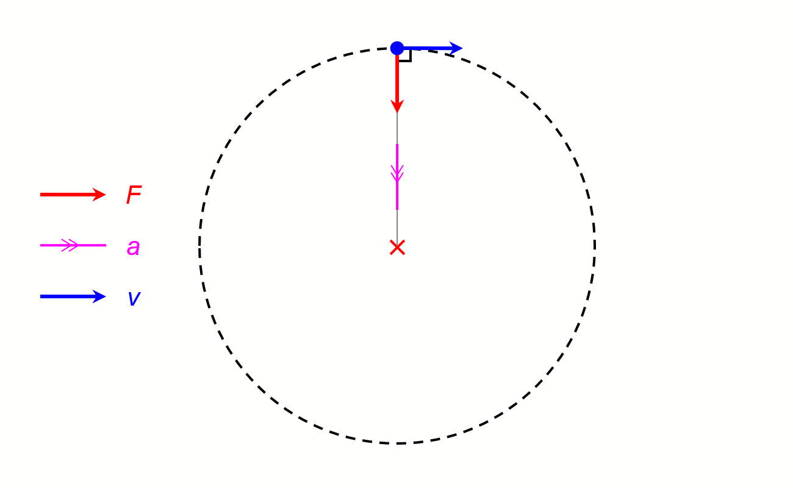

# Problem 1

# Orbital Period and Orbital Radius

# Project Documentation

<iframe width="560" height="315" src="https://www.youtube.com/embed/bcvnfQlz1x4?si=bl428S7Xqp5I51gK" title="YouTube video player" frameborder="0" allow="accelerometer; autoplay; clipboard-write; encrypted-media; gyroscope; picture-in-picture; web-share" referrerpolicy="strict-origin-when-cross-origin" allowfullscreen></iframe>

---
[Simulation](Problem_1.html)
---

### 1. Derivation of the Relationship

For a circular orbit, the gravitational force provides the centripetal force required to keep an object (mass $m$) orbiting a central body (mass $M$) at radius $r$.

#### Gravitational Force
$$F_g = \frac{G M m}{r^2}$$

where $G$ is the gravitational constant ($6.67430 \times 10^{-11} \, \text{m}^3 \text{kg}^{-1} \text{s}^{-2}$).

#### Centripetal Force
For circular motion with orbital speed $v$ and period $T$:

$$v = \frac{2\pi r}{T}$$

Centripetal force:

$$F_c = \frac{m v^2}{r} = \frac{m}{r} \left( \frac{2\pi r}{T} \right)^2 = \frac{4\pi^2 m r}{T^2}$$

#### Equate Forces
$$\frac{G M m}{r^2} = \frac{4\pi^2 m r}{T^2}$$

Cancel $m$ (assuming $m \neq 0$):

$$\frac{G M}{r^2} = \frac{4\pi^2 r}{T^2}$$

Rearrange:

$$T^2 = \frac{4\pi^2}{G M} r^3$$

Thus:

$$T^2 = k r^3$$

where $k = \frac{4\pi^2}{G M}$ is a constant for a given central mass $M$. This is Kepler’s Third Law for circular orbits.

---

### 2. Implications for Astronomy

- **Mass Determination**: If $T$ and $r$ are measured (e.g., via observation), $M$ can be calculated:

$$M = \frac{4\pi^2 r^3}{G T^2}$$

  This is how we estimate the Sun’s mass using Earth’s orbit or Earth’s mass using the Moon’s orbit.

- **Distance Calculation**: Knowing $T$ and $M$, solve for $r$:

$$r = \left( \frac{G M T^2}{4\pi^2} \right)^{1/3}$$

- **System Scaling**: For planets orbiting the Sun, $T^2 / r^3$ is constant, allowing comparisons across the Solar System.

