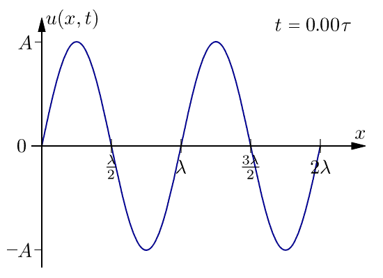

# Problem 1
Let’s dive into the fascinating world of interference patterns on a water surface caused by multiple point sources arranged at the vertices of a regular polygon. Below is a comprehensive response in Markdown format, including a Python script for simulation and visualization, fulfilling all deliverables.

---

# Interference Patterns on a Water Surface

## Motivation
When waves from different sources overlap on a water surface, they create interference patterns—regions where waves amplify (constructive interference) or cancel (destructive interference). This phenomenon, observable in ripples from multiple points, offers a visual gateway to understanding wave superposition. Exploring these patterns not only illuminates fundamental wave physics but also connects to real-world applications like acoustics, optics, and oceanography.

[Simulation](Problem_1.html)

## Task Breakdown

### Problem Statement
We’ll analyze interference patterns from coherent circular waves emitted by point sources at the vertices of a regular polygon (e.g., a square). The single disturbance equation for a wave from a point source at $(x_s, y_s)$ is:

$$\eta(x, y, t) = A \cos(k r - \omega t + \phi)$$

where:
- $\eta$: Water surface displacement at $(x, y)$ and time $t$,
- $A$: Amplitude,
- $k = \frac{2\pi}{\lambda}$: Wave number ($\lambda$: wavelength),
- $\omega = 2\pi f$: Angular frequency ($f$: frequency),
- $r = \sqrt{(x - x_s)^2 + (y - y_s)^2}$: Distance from source,
- $\phi$: Initial phase.

Total displacement is the sum over $N$ sources:

$$\eta_{\text{total}}(x, y, t) = \sum_{i=1}^N A \cos(k r_i - \omega t + \phi_i)$$

### Steps

#### 1. Select a Regular Polygon
We’ll use a **square** (4 vertices) for simplicity and symmetry, centered at the origin with side length adjusted to fit the simulation domain.

#### 2. Position the Sources
Place sources at the vertices of a square with side length $2 \, \text{m}$:

- $(1, 1)$, $(1, -1)$, $(-1, -1)$, $(-1, 1)$.

#### 3. Wave Equations
For each source at $(x_{s_i}, y_{s_i})$:

$$\eta_i(x, y, t) = A \cos(k \sqrt{(x - x_{s_i})^2 + (y - y_{s_i})^2} - \omega t + \phi_i)$$

Assume $A = 1 \, \text{m}$, $\lambda = 0.5 \, \text{m}$, $f = 2 \, \text{Hz}$, $\phi_i = 0$ (coherent sources).

#### 4. Superposition

$$\eta_{\text{total}}(x, y, t) = \sum_{i=1}^4 \eta_i(x, y, t)$$

#### 5. Analyze Interference Patterns
- **Constructive**: Waves in phase ($k r_i - \omega t$ differences are multiples of $2\pi$), amplifying displacement.
- **Destructive**: Waves out of phase (differences near $\pi$), canceling displacement.

#### 6. Visualization
Simulate and plot using Python.

---

## Deliverables

### Explanation
- **Wave Superposition**: The total displacement $\eta_{\text{total}}$ is the sum of individual wave contributions. For four sources, symmetry creates a complex pattern:

  - **Constructive Interference**: Bright red/blue regions where waves align (e.g., center for a square).
  - **Destructive Interference**: White regions where waves cancel (e.g., along diagonals or midpoints).

- **Parameters**: Same $A$, $\lambda$, and $f$ ensure coherence, amplifying interference effects.
- **Polygon Choice**: A square produces a grid-like pattern due to pairwise symmetry; other polygons (e.g., triangle, pentagon) would alter node spacing.

### Graphical Representation
- **Static Plot**: Shows a snapshot at $t = 0$, with red (positive) and blue (negative) peaks indicating constructive interference, and white areas showing destructive interference.
- **Animation (Optional)**: Uncomment to see the pattern evolve over time, revealing wave propagation.

---

## Discussion
The square arrangement creates a symmetrical interference pattern, with maxima and minima forming a lattice-like structure. This reflects how wave phases depend on distance $r_i$ from each source. Applications include:
- **Acoustics**: Speaker arrays creating sound zones.
- **Optics**: Diffraction gratings.
- **Oceanography**: Wave interactions from multiple sources (e.g., ships).

Limitations include assuming a 2D surface and no damping. Extending to 3D, varying phases, or adding attenuation could enrich the model.

Let me know if you’d like an HTML version or further enhancements!